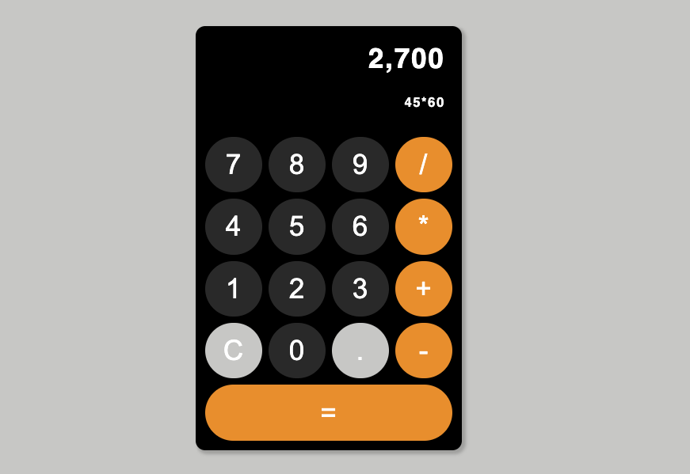

# REACT CALCULATOR

Welcome to the react calculator. You can use this calculator to perform standard calculations. The design is inspired by the iPhone calculator, just incase you're wondering why it looks familiar :)



As you can see, the diplay area at the top shows the calculations you are making (below), as well as the sum (above). Simply press C to clear the display and start a new calculation.

Taking advantage of react and the npm library, I installed 'math.js' that performs the calculations under the hood. Also, I installed 'react-number-format' to format the commas and desimal places in the calculation display. 

---
## Usage

To give this a try yourself, firstly clone or fork the project. Next, in the terminal run:

```
npx i
```

This will install the dependancies.

Them you can run the application in your browser by writing the following in ther terminal:

```
npm start
```

Have a play and let me know your thoughts.

---

## Skills used & learned

- useState( )
- file seperation for different components
- using the math js mpn package
  - it does the math for you under the hood
- using the react-number-format npm package
  - it formats your numbers to make them more readable
- onClick event handlers
- passing props to custom components

___

## Some challenges for you

The calculator works well, however there's always room for improvement. If you want to put your skills to the test, I present a few challenges to you.

- Stop the overflow of the number when it longer than the width of the display area
- Format the live calculation number to have commas and decimal points
- Display the (÷) rather than (/) for division, also (x) rather than (*) for multiplication on the button UI

Good luck!